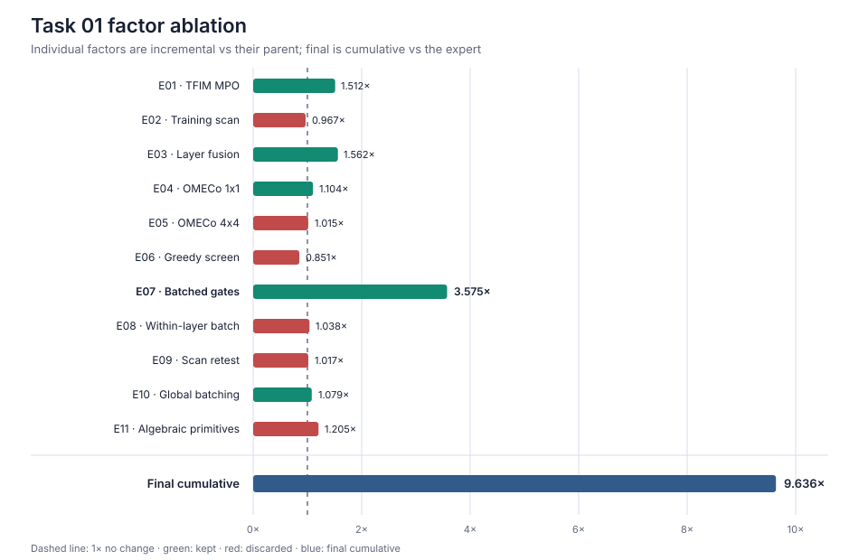

# Challenge 01: compress the graph before differentiation

**Take-home insight.** The expert traces a large repeated computation graph:
63 Hamiltonian contractions and hundreds of scalar gate constructors. Replacing
the Hamiltonian by one exact bond-dimension-three TensorCircuit MPO, fusing
layer-local gates, and batch-constructing the remaining gate matrices shrinks
that graph before autodiff; batched construction is the largest isolated
factor at **3.575x**, and the complete solution reaches **9.636x**.

## Factor speedups

Each multiplier is the measured paired speedup relative to that factor's
direct parent, so retained rows are incremental rather than cumulative.

| ID | Factor | Speedup vs parent | Decision |
| --- | --- | ---: | --- |
| E01 | Direct bond-three TFIM MPO | **1.512x** (5 pairs) | **Keep** |
| E02 | Whole-training `K.jaxy_scan` | 0.967x (5 pairs) | Discard |
| E03 | Exact layer-local gate fusion | **1.562x** (5 pairs) | **Keep** |
| E04 | OMECo `1x1` path search | 1.104x (5 pairs) | Keep |
| E05 | OMECo `4x4` path search | 1.015x (5 pairs) | Discard |
| E06 | Greedy contractor screen | 0.851x (1 screening pair) | Discard |
| E07 | Batched closed-form gate construction | **3.575x** (5 pairs) | **Keep** |
| E08 | Within-layer pair-product batching | 1.038x (5 pairs) | Discard |
| E09 | Training-scan retest after compression | 1.017x (5 pairs) | Discard |
| E10 | Cross-layer global gate batching | 1.079x (6 pairs) | Keep |
| E11 | Algebraic contraction primitives | 1.205x (6 pairs) | Discard |

## What the factors mean

- **E01 — direct TFIM MPO:** replace 31 `ZZ` and 32 `X` contractions with one
  exact TensorCircuit `QuOperator` MPO expectation.
- **E02 — training scan:** stage all 500 Adam steps in one backend scan.
- **E03 — layer-local fusion:** assemble each Euler sequence and commuting
  Pauli-product bond sequence into exact local matrices.
- **E04 — OMECo `1x1`:** reduce TreeSA path search to one trial and one
  iteration on the compressed graph.
- **E05 — OMECo `4x4`:** spend more TreeSA search effort without a reliable
  additional gain.
- **E06 — greedy contractor:** replace OMECo with TensorCircuit's preprocessed
  greedy contraction in a one-pair screen.
- **E07 — batched gate construction:** build Euler, Pauli-product, Kronecker,
  and pair-product matrices with TensorCircuit backend batches.
- **E08 — within-layer batching:** batch pair products independently inside
  each layer.
- **E09 — scan retest:** retry the whole-training scan after graph
  compression.
- **E10 — global batching:** extend retained gate construction batches across
  layers.
- **E11 — algebraic primitives:** enable primitive contraction algebra, whose
  paired interval crossed no change.

## End-to-end result

Across six alternating matched pairs, the unchanged expert averaged
`60.651144 s` and
[`solution_1_graph_compression.py`](solution_1_graph_compression.py) averaged
`6.359807 s`. The mean paired speedup was **9.636410x** (6/6 candidate wins;
95% t-interval `8.680782x–10.592037x`). These timings are a same-host,
same-container comparison using the local evaluator with 6 CPUs and a 7 GiB
memory limit; absolute runtimes should not be compared across machines.
