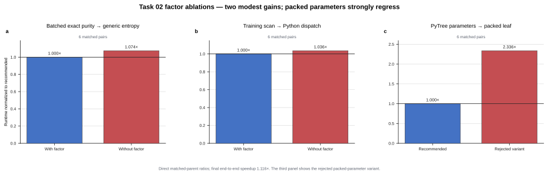

# Challenge 02: stage the trajectory and batch purity

**Take-home insight.** Keep the full optimization trajectory inside
TensorCircuit backend transforms: one `K.jaxy_scan` removes 500 host
dispatches, while `K.vmap` evaluates the three checkpoint purities together
and replaces dense `rho @ rho` with the exact Frobenius identity. These are
the only retained factors and give a **1.116x** end-to-end speedup.

## Factor speedups

Each multiplier is the measured paired speedup relative to that factor's
direct parent, so retained rows are incremental rather than cumulative.

| ID | Factor | Speedup vs parent | Decision |
| --- | --- | ---: | --- |
| E01 | Exact local gate fusion | 0.966x | Discard |
| E02 | Whole-training `K.jaxy_scan` | **1.036x** | **Keep** |
| E03 | Frobenius purity alone | 1.025x | Discard (inconclusive) |
| E04 | TensorCircuit sparse XXZ | 0.973x | Discard |
| E05 | Single-leaf parameter packing | 0.428x | Discard |
| E06 | Checkpoint entropy `K.vmap` alone | 1.047x | Discard (inconclusive) |
| E07 | `K.vmap` plus exact Frobenius purity | **1.074x** | **Keep** |

*Figure — Each panel normalizes its recommended direct parent to `1.0x`.
Removing the two accepted factors causes modest slowdowns; packing the
parameter PyTree is the largest measured regression. Ratios come from direct
matched-parent experiments and are not multiplied.*

## What the factors mean

- **E01 — local gate fusion:** reduce 243 gate applications to 105 exact
  matrices, whose dynamic construction outweighed the smaller circuit.
- **E02 — training scan:** carry parameters and Optax state through one
  500-step `K.jaxy_scan`.
- **E03 — Frobenius purity:** replace `trace(rho @ rho)` with the exact
  Hermitian Frobenius identity.
- **E04 — sparse XXZ:** replace 45 termwise matrix-vector products with a
  TensorCircuit sparse Hamiltonian multiplication.
- **E05 — packed parameters:** pack ten PyTree leaves into one `(3, 81)`
  tensor.
- **E06 — entropy `K.vmap`:** batch the unchanged checkpoint entropy kernel.
- **E07 — batched exact purity:** combine `K.vmap` with the Frobenius identity
  so the three reduced density matrices share one batch.

## End-to-end result

Across six alternating matched pairs, the unchanged expert averaged
`4.495463 s` and
[`solution_2_training_scan_batched_purity.py`](solution_2_training_scan_batched_purity.py)
averaged `4.031039 s`. The mean paired speedup was **1.115649x** (6/6
candidate wins; 95% t-interval `1.057686x–1.173613x`). These timings are a
same-host, same-container comparison using the local evaluator with 6 CPUs and
a 7 GiB memory limit; absolute runtimes should not be compared across
machines.
