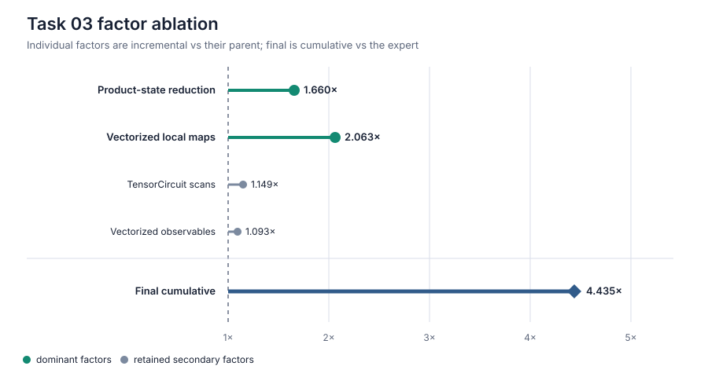

# Challenge 03: exact product-state contraction

**Take-home insight.** Post-selecting every even qubit after each brickwork
layer prevents the surviving odd qubits from ever becoming mutually
entangled. The optimized solution therefore evolves six exact two-component
states and batches their identical local conditional maps with TensorCircuit
`K.vmap`, instead of constructing a 12-qubit circuit; these two factors give
`1.660x` and `2.063x` incremental speedups.

## Factor speedups

Each multiplier is the measured paired speedup relative to that factor's
immediate parent, so the rows are incremental rather than cumulative.

| Factor | Speedup vs parent | Decision |
| --- | ---: | --- |
| Exact product-state reduction | **1.660x** | **Keep** |
| Batch local conditional maps with `K.vmap` | **2.063x** | **Keep** |
| Put the dependent evolution/training loops in `K.jaxy_scan` | 1.149x | Keep |
| Batch product-state observables with `K.vmap` | 1.093x | Keep |

## What the factors mean

- **Product-state reduction:** projection removes every even qubit before
  another layer can connect two survivors, so the selected branch remains an
  exact six-qubit product state.
- **Vectorized local maps:** `K.vmap` evaluates the six independent
  `<0_even|U|even_input>` contractions as one TensorCircuit computation.
- **TensorCircuit scans:** `K.jaxy_scan` stages the dependent circuit evolution
  and optimizer updates instead of dispatching Python loops.
- **Vectorized observables:** `K.vmap` evaluates the independent one-qubit
  expectations together.

## End-to-end result

Across six alternating matched pairs, the unchanged expert averaged
`4.101350 s` and
[`solution_3_product_contraction.py`](solution_3_product_contraction.py)
averaged `0.924608 s`. The mean paired speedup was **4.435277x** (6/6
candidate wins; 95% t-interval `4.287006x–4.583549x`). These timings are a
same-host, same-container comparison using the local evaluator; absolute
runtimes should not be compared across machines.
