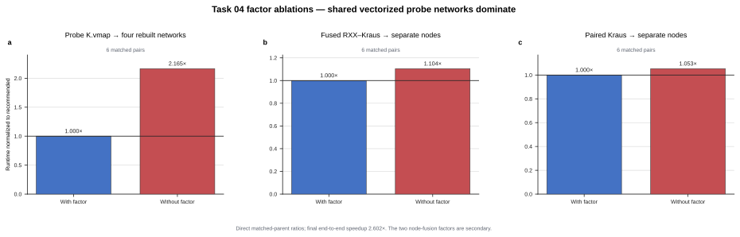

# Challenge 04: faster trainable Kraus-noise calibration

**Take-home insight.** The dominant cost was tracing and compiling four copies
of the same noisy tensor network. Preparing the four probe states once and
batching a single shared TensorCircuit circuit with `K.vmap` gave a
**2.165x** speedup by itself; the final implementation adds two exact local
node fusions and reaches **2.602x** end to end.

## Factor speedups

Each multiplier below is the measured paired speedup relative to that factor's
accepted parent, so retained rows are incremental rather than cumulative.

| Factor | Speedup vs parent | Decision |
| --- | ---: | --- |
| Public-name substitution (`DMCircuit` → `DMCircuit2`) | 1.018x | Discard |
| Batch four probe networks with `K.vmap` | **2.165x** | **Keep** |
| Put all Adam updates in `K.jaxy_scan` | 0.987x | Discard |
| Reuse one full density tensor for all expectations | No valid timing (9.26 GB allocation exceeded 7 GiB) | Discard |
| Pair adjacent one-qubit Kraus nodes | 1.053x | Keep |
| Fuse each RXX gate into its paired Kraus node | 1.104x | Keep |
| Use a static Kraus matrix-unit basis | 0.969x | Discard |

*Figure — Each panel normalizes the accepted implementation to `1.0x` and
shows runtime after removing that factor. Shared probe-network vectorization
is the dominant contribution; the two node-fusion changes are secondary.
Ratios use their direct matched parents and are not multiplied.*

## What the factors mean

- **Public-name substitution:** both public names resolved to the same class in
  the measured TensorCircuit-NG image, so the edit was a no-op.
- **Probe `K.vmap`:** reuse four prepared probe states and trace one batched
  noisy circuit instead of four separate circuit graphs.
- **Training scan:** compile the 120 dependent optimizer steps as one
  TensorCircuit scan.
- **Expectation reuse:** materialize one density tensor for the 13 observables,
  which exceeded the fixed memory limit.
- **Paired Kraus node:** replace two independent three-Kraus channels by their
  exact nine-Kraus product channel.
- **Fused RXX–Kraus node:** absorb the fixed RXX unitary into those nine Kraus
  matrices, removing every explicit entangler node.
- **Static Kraus basis:** replace backend-built matrix units with fixed
  complex64 constants.

## End-to-end result

Across six alternating matched pairs, the unchanged expert averaged
`14.742286 s` and [`solution_4_fused_kraus.py`](solution_4_fused_kraus.py)
averaged `5.672258 s`. The mean paired speedup was **2.602133x** (6/6
candidate wins; 95% t-interval `2.529463x–2.674804x`). These timings are a
same-host, same-container comparison using the local evaluator with 6 CPUs and
a 7 GiB memory limit; absolute runtimes should not be compared across
machines.
