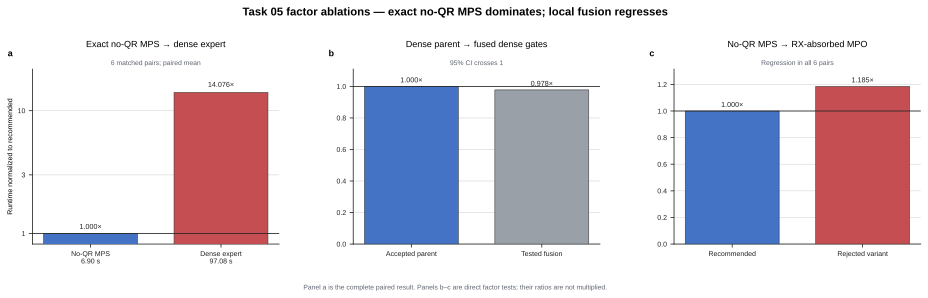

# Task 05 — exact bounded-rank MPS cooling

> **Take-home insight:** keep the cooling state as the exact low-rank MPS
> generated by the shallow filter circuit. This removes the dense-state work
> that dominates the expert implementation; local gate fusion is not the
> source of the speedup.

## Factor speedups

| Factor | Measured speedup | Decision |
|---|---:|---|
| Exact no-QR MPS instead of the immutable dense expert | **14.076x** | Keep — dominant |
| Fuse gates while keeping the dense representation | 1.023x, CI crosses 1x | Discard |
| Absorb `RX` into the rank-2 MPS filter MPO | 0.844x | Discard — regression |

## What the factors mean

- **Exact no-QR MPS:** apply every cooling filter directly to its bounded-rank
  MPS representation without constructing a dense state or adding unnecessary
  QR canonicalization.
- **Dense gate fusion:** combine adjacent dense filters but retain the
  expensive dense-state execution model.
- **MPS-local `RX` absorption:** enlarge the filter MPO to absorb `RX`; the
  added local tensor work is slower than applying `RX` separately.

## End-to-end result

All six matched reference/candidate pairs passed. Mean runtime fell from
`97.083712 s` to `6.898409 s`, for a mean paired speedup of **14.075570x**
(6/6 candidate wins). These are same-container local-engine measurements.
