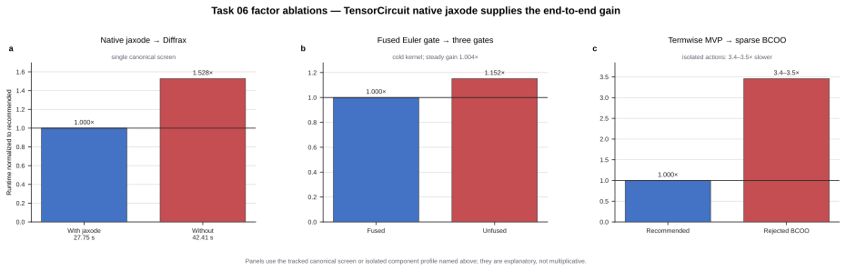

# Task 06 — use TensorCircuit's native `jaxode` backend

> **Take-home insight:** the acceleration comes from selecting TensorCircuit's
> native `jaxode` ODE backend for the unchanged adaptive evolution. Gate fusion
> is secondary; automatic `dt0` and sparse BCOO Hamiltonians do not help.

## Factor speedups

| Factor | Measured speedup | Decision |
|---|---:|---|
| TensorCircuit native `jaxode` | **1.529x** single-screen | Keep — dominant |
| Exact `RZ → RY → RZ` Euler fusion | 1.152x cold; 1.004x steady | Keep — secondary |
| Diffrax automatic `dt0` | 1.001x | Discard — neutral |
| BCOO Hamiltonian actions | 0.29x–0.30x | Discard — regression |

## What the factors mean

- **Native `jaxode`:** run the same `tc.timeevol.ode_evol_global` problem
  through TensorCircuit's faster native backend without changing the vector
  field, tolerances, endpoints, or step bound.
- **Euler fusion:** replace each exact three-gate Euler sequence with one
  phase-corrected TensorCircuit `U` gate while retaining all parameters.
- **Automatic `dt0`:** let the solver choose its initial step instead of using
  the expert's explicit value.
- **BCOO actions:** replace the small termwise Hamiltonian products with sparse
  matrix multiplication; this stack makes them substantially slower.

## End-to-end result

All five matched pairs passed. Mean runtime fell from `41.4259 s` to
`27.5366 s`, for a mean paired speedup of **1.50446x** (5/5 candidate wins).
These are same-container local-engine measurements.
