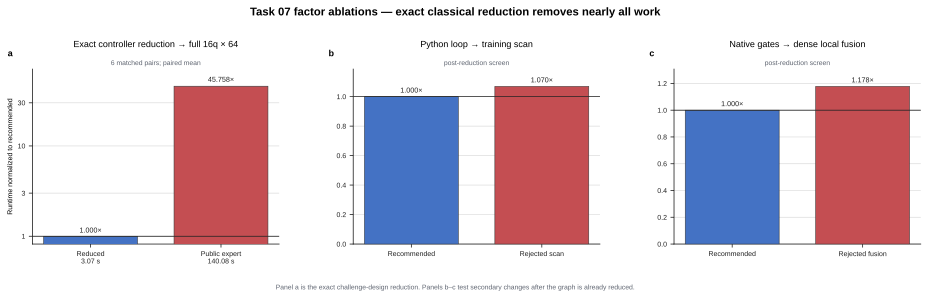

# Task 07 — exact classical-ancilla reduction

> **Take-home insight:** the published circuit does not require 64 full
> 16-qubit measured trajectories. Its measured ancillas form an analytically
> sampled classical controller, and the fixed workload contains only two unique
> eight-qubit branches with weights `63/64` and `1/64`.

## Factor speedups

| Factor | Measured speedup | Decision |
|---|---:|---|
| Eliminate the classical ancillas and merge duplicate trajectories | **45.758x** end to end | Keep — dominant |
| Whole-training `K.jaxy_scan` after reduction | 0.935x | Discard — regression |
| Explicit dense `RY`/`RZ` gate fusion after reduction | 0.849x | Discard — regression |
| Default local contractor over greedy | 1.044x | Keep default — minor |
| Default local contractor over OMECo 1x1 | 1.040x, CI crosses 1x | Do not switch |

## What the factors mean

- **Classical-ancilla reduction:** sample the independent pre-ladder ancilla
  bits analytically, invert the CNOT prefix-XOR exactly, and replace conditioned
  `RZZ` operations with data-only `RZ` gates.
- **Trajectory merging:** evaluate the two unique fixed branch patterns once
  and weight them by their multiplicities instead of contracting 64 duplicates.
- **Training scan:** compile all optimizer steps as one scan after the graph is
  already small; its extra compile cost is not recovered here.
- **Dense gate fusion:** materialize fused local gates; this is slower than the
  native small-gate sequence for the reduced circuit.
- **Contractor changes:** path-search tuning is negligible once only two
  eight-qubit branches remain.

## End-to-end result

All six matched pairs passed. Mean runtime fell from `140.076441 s` to
`3.070839 s`, for a mean paired speedup of **45.757921x** (6/6 candidate
wins). This is an exact reduction of the published workload, but it also
exposes a challenge-design loophole rather than a generic mid-circuit
measurement acceleration.

To preserve the intended framework test, a future task should require the full
measured register or use non-diagonal ancilla interactions that make
measurement probabilities depend on the data state; changing only the seed
does not close the reduction.
