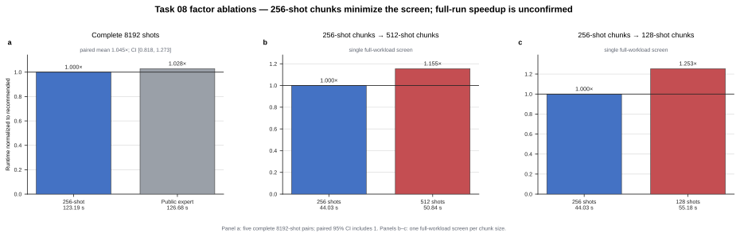

# Task 08 — bounded TensorCircuit sampling batches

## Take-home insight

**Keep the public expert’s TensorCircuit circuit and all 8192
`perfect_sampling` trajectories, but execute the mapped sampler in contiguous
256-shot blocks.** A single 8192-shot `vmap` puts the shot axis into every XLA
contraction intermediate; bounding that axis is the only material change and
reduces the peak live tensor-network workload without changing the sampling
algorithm.

## Factor attribution

| Factor | Full-workload result | Decision |
| --- | ---: | --- |
| 512-shot blocks | 50.843 s single screen | Feasible, not best |
| **256-shot blocks** | **44.028 s single screen** | **Promote** |
| 128-shot blocks | 55.182 s single screen | Dispatch overhead |

*Figure — On the complete sufficient-memory five-pair comparison, chunking
does not resolve a runtime speedup. The 256-shot setting is retained because it
has the best full-workload chunk-size screen and bounds peak intermediates.*

## What the factors mean

- **Bounded mapped batch:** the same cached TensorCircuit
  `K.jit(K.vmap(perfect_sampling))` function consumes 32 contiguous slices
  instead of the complete status matrix at once. Every seeded status row is
  still consumed exactly once and in the original order.
- **Chunk size:** 512 leaves larger contraction intermediates live; 128 adds
  excess host dispatch. A 256-shot block is the measured balance for this
  workload.

## Complete canonical result

A sufficient-memory, same-node, six-CPU-affinity five-pair session ran the
complete 8192-shot workload for both implementations:

| Metric | Public expert | 256-shot candidate |
| --- | ---: | ---: |
| Passing runs | 5/5 | 5/5 |
| Mean runtime | 126.675 s | 123.188 s |
| Pair wins | 2/5 | 3/5 |
| Mean pairwise speedup | — | 1.045x |
| 95% Student-t interval | — | [0.818, 1.273] |

The interval crosses 1.0, so there is **no confirmed runtime speedup**. The
promoted benefit is bounded peak memory: under tighter allocations the
monolithic mapped batch can exhaust memory, while the 256-shot implementation
completes the unchanged workload. The exact memory threshold is hardware and
contraction-path dependent; the full allocation study remains in the benchmark
research repository.
