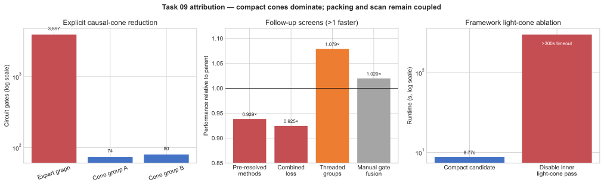

# Challenge 09: compact causal-cone execution

**Take-home insight.** Scan the supplied gate tape backwards and build
TensorCircuit graphs only for each observable's exact causal cone. On the
public workload this cuts a 512-qubit, 3,897-gate construction to two compact
graphs with 18/15 qubits and 74/80 gates; this structural reduction is the
dominant reason the final implementation is faster.

## Factor speedups

| Factor | Measured speedup or effect | Decision |
|---|---:|---|
| Pre-construction causal cones, packed active parameters, and compiled optimizer trajectory | `3.8217x` end to end versus the expert (bundled measurement) | **Keep — dominant** |
| TensorCircuit `enable_lightcone=True` inside each compact graph | Removing it exceeded the `300 s` timeout; final mean is `8.77 s` | **Keep — required** |
| Separate parameter-disjoint cone groups | `1.082x` versus one combined loss (three-pair screen) | Keep |
| Pre-resolved gate methods | `0.9385x` (regression) | Discard |
| Threaded cone-group submission | `1.079x` in three screening pairs | Discard from the promoted solution |
| Manual single-qubit gate fusion | `1.0197x`, 95% CI `[0.9692x, 1.0702x]` | Discard |

*Figure — Panel a shows the complete compact-cone solution against the public
expert. Panel b is a removal lower bound: disabling TensorCircuit's inner
light-cone cancellation exceeds the 300-second limit. Panel c directly removes
cone separation. Unisolated packing and scan contributions are not assigned
invented percentages.*

## What the factors mean

- **Pre-construction causal cones** remove irrelevant gates before TensorCircuit allocates their tensor nodes, while packing keeps only the 154 active optimizer coordinates.
- **Inner light-cone cancellation** still simplifies the doubled bra-observable-ket network after explicit tape pruning.
- **Separate groups** train parameter-disjoint observable cones independently and sum their pre-update histories.
- **Pre-resolved methods** replace trace-time string lookup with cached unbound gate methods, but measured slower.
- **Threading** submits the two independent groups concurrently, but was not promoted after only a three-pair screen.
- **Manual fusion** combines runs of local gates, but its confidence interval includes no improvement.

## End-to-end result

All six matched local-engine pairs passed. Expert and optimized means were
`33.503727 s` and `8.766516 s`; mean paired speedup was `3.821725x` with a
95% t-interval of `[3.729633x, 3.913817x]`. This is same-host local-engine
evidence (4 vCPU, pinned lock), not a completed Docker promotion run.
