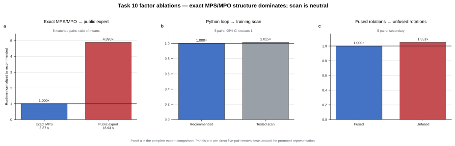

# Challenge 10: exact bounded-rank MPS/MPO contraction

**Take-home insight.** Keep the state and operators in their exact small-bond
MPS/MPO forms, and contract the fixed local network directly through
TensorCircuit-NG. This removes the expert's generic
circuit-bra/MPO/circuit-ket contraction-path search and large cold compilation
graph; the scan and local rotation fusion are not the source of the headline
gain.

## Factor speedups

| Factor | Measured speedup or effect | Decision |
|---|---:|---|
| Exact bounded-rank MPS/MPO representation | At least `4.67x` end to end even in the slower unfused ablation | **Keep — dominant** |
| Whole-training `K.jaxy_scan` | `0.9857x`, 95% CI `[0.9394x, 1.0320x]` | Discard from the performance claim |
| Fused `RX -> RZ -> RY` application | `1.0515x`, 95% CI `[0.9753x, 1.1277x]` | Keep in code; secondary |

## What the factors mean

- **Bounded-rank contraction** applies the exact bond-2 CMZ and bond-3 TFIM MPO to the low-rank MPS without generic OMECo path search.
- **Whole-training scan** moves all 200 Adam updates into one backend scan, but its removal did not slow this cold end-to-end workload.
- **Rotation fusion** builds each local `RX -> RZ -> RY` sequence as one differentiable 2x2 gate and provides only a small measured benefit.

## End-to-end result

All ten cells in five counterbalanced Docker pairs passed. Expert and optimized
means were `18.931296 s` and `3.869287 s`; mean paired speedup was `4.898251x`
with a 95% t-interval of `[4.597784x, 5.198719x]` (the supplemental sixth
pair also passed). Both sides used the same network-disabled 6-CPU/7-GiB
container and TensorCircuit nightly `1.8.0.dev20260726`; the result is not a
cross-version or cross-hardware claim.
