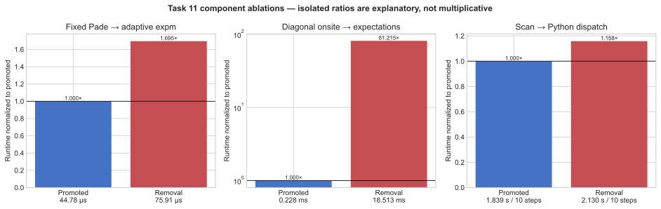

# Challenge 11: reduce dense-state passes

**Take-home insight.** This workload is bandwidth-bound on the dense
\(3^{12}\) state, so the decisive optimization is to touch that state fewer
times: fuse each layer from 47 to 11 gate applications and replace twelve
onsite expectation contractions with one diagonal coefficient-vector
reduction.

## Factor speedups

| Factor | Measured speedup or effect | Decision |
|---|---:|---|
| Layer gate fusion | 47 to 11 dense-state applications per layer; not isolated from the promoted layer representation | **Keep — dominant** |
| Diagonal onsite vector | `81.215x` for the isolated onsite term | **Keep — dominant** |
| Batched fixed Pade entanglers | `1.695x` for isolated gate execution | Keep |
| Whole-training scan | `1.158x` for identical 10-step execution | Keep; secondary |

## What the factors mean

- **Layer fusion** composes the three local spin-1 rotations and absorbs even-site pairs into their 9x9 entanglers before applying them to the state.
- **Diagonal onsite evaluation** computes the single-ion term from one precomputed basis coefficient vector instead of twelve circuit expectations.
- **Batched fixed Pade** constructs every entangler in a layer together without separate adaptive matrix exponentials.
- **Whole-training scan** runs all 500 Adam updates in one compiled backend control-flow unit.

## End-to-end result

All six matched local-engine pairs passed. Expert and optimized means were
`168.361539 s` and `114.968325 s`; mean paired speedup was `1.464430x` with a
95% t-interval of `[1.457317x, 1.471543x]`. This is same-host local-engine
evidence (4 vCPU, pinned dependencies); the formal Docker promotion rerun
remains outstanding.
