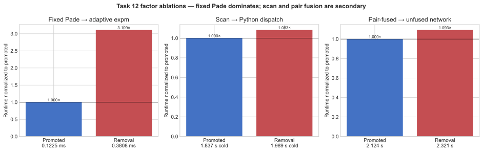

# Challenge 12: batched fixed-order SU4 construction

**Take-home insight.** Build all 31 SU4 generators in one batch and replace
31 separate adaptive Pade-13 exponentials with one fixed-order batched
Pade(3,3) scaling-and-squaring kernel. This shrinks the differentiated
compilation graph and is the dominant source of the end-to-end speedup.

## Factor speedups

| Factor | Measured speedup or effect | Decision |
|---|---:|---|
| Batched fixed-order Pade gate construction | `3.109x` for the isolated gate-build/gradient/Adam kernel | **Keep — dominant** |
| Whole-training scan | `1.270x` for execution, but only `1.083x` including cold lowering and compilation | Keep; secondary |
| Pair-fused ququart contraction | `1.093x` incremental end to end | Discard from the promoted upstream solution |

## What the factors mean

- **Batched fixed Pade** forms and exponentiates the complete `(31, 4, 4)` SU4 batch with one static TensorCircuit/JAX kernel.
- **Whole-training scan** runs all 5,000 Adam updates in one compiled backend loop.
- **Pair fusion** rewrites the network on 16 four-level sites, but its small tracked gain does not justify a second upstream solution.

## End-to-end result

All six matched local-engine pairs passed for the promoted
`solution_12_batched_su4.py`. Expert and optimized means were `9.082742 s`
and `2.320613 s`; mean paired speedup was `3.914003x` with a 95% t-interval
of `[3.876545x, 3.951460x]`. This is same-host local-engine evidence (4 vCPU,
pinned dependencies); the formal Docker promotion rerun remains outstanding.
