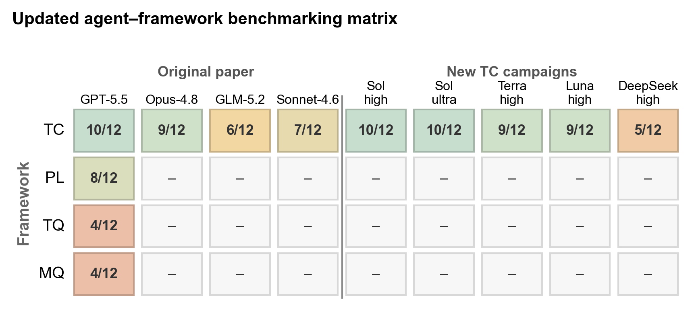
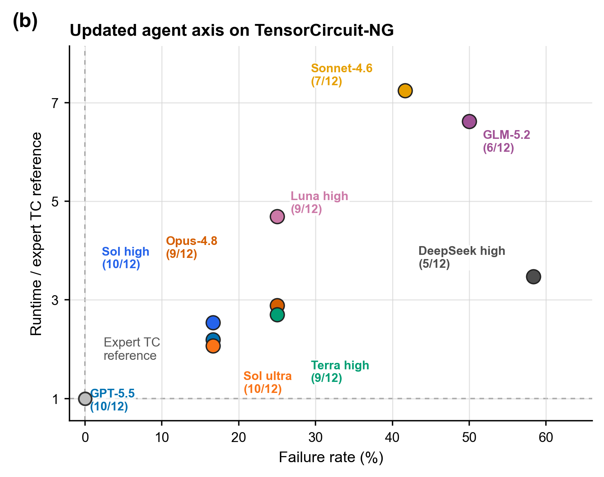
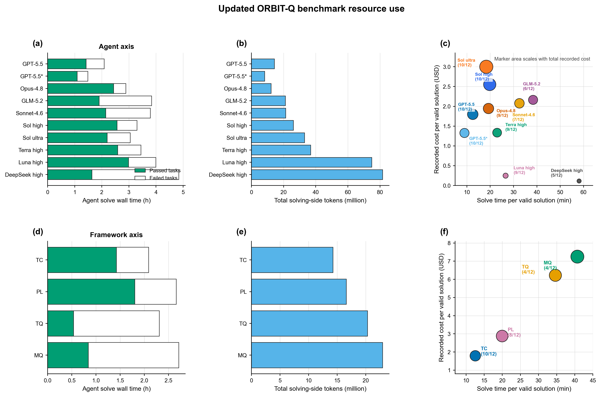
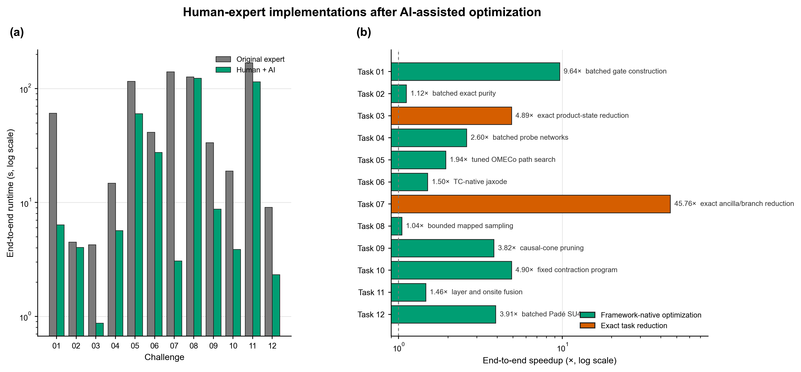

# ORBIT-Q paper-update figures

This directory provides paper-ready updates to Fig. 1c, Fig. 2b, and Fig. 4
of [arXiv:2607.03105](https://arxiv.org/abs/2607.03105), plus one new summary
figure for AI-assisted optimization of the 12 human-expert implementations.
The deliverables are editable SVG and vector PDF; PNG files are previews only.
Fable 5 and DeepSeek max are intentionally excluded.

## Updated Fig. 1c — agent–framework benchmark matrix

[SVG](updated_figures/fig1c_updated_agent_framework_matrix.svg) ·
[PDF](updated_figures/fig1c_updated_agent_framework_matrix.pdf) ·
[PNG](updated_figures/fig1c_updated_agent_framework_matrix.png)

The original paper matrix is retained on the left. The five new
TensorCircuit-NG campaigns extend it on the right: Sol high **10/12**, Sol
ultra **10/12**, Terra high **9/12**, Luna high **9/12**, and DeepSeek V4
Flash high **5/12**. Task 08 is counted as failed for every new campaign after
final human-expert review.

## Updated Fig. 2b — failure rate versus artifact runtime

[SVG](updated_figures/fig2b_updated_agent_axis.svg) ·
[PDF](updated_figures/fig2b_updated_agent_axis.pdf) ·
[PNG](updated_figures/fig2b_updated_agent_axis.png)

This is the paper's original metric: the geometric mean artifact-runtime
ratio is computed only over passed tasks and uses the original paper's public
expert TensorCircuit references. The resulting ratios are **2.54×**, **2.07×**,
**2.70×**, **4.69×**, and **3.48×** for Sol high, Sol ultra, Terra high, Luna
high, and DeepSeek high, respectively. These values should not be replaced by
same-machine ratios from a different campaign.

## Updated Fig. 4 — benchmark resource use

[SVG](updated_figures/fig4_updated_agent_framework_resources.svg) ·
[PDF](updated_figures/fig4_updated_agent_framework_resources.pdf) ·
[PNG](updated_figures/fig4_updated_agent_framework_resources.png)

The original 2 × 3 layout is preserved. Panels (a–c) combine the five original
agent configurations with the five new campaigns; panels (d–f) retain the
paper's original framework comparison. Gray bars in panel (b) show the legacy
total-token values because the paper tables do not publish their token
components. Panels (b) and (e) therefore use one consistent total-token
encoding for every configuration. Bubble area represents total recorded cost.

## New figure — human expert + AI co-optimization

[SVG](updated_figures/expert_optimization_updated_overview.svg) ·
[PDF](updated_figures/expert_optimization_updated_overview.pdf) ·
[PNG](updated_figures/expert_optimization_updated_overview.png)

Panel (a) compares end-to-end runtime before and after optimization on a log
scale. Panel (b) reports the paired end-to-end speedup and the dominant insight
retained after ablation. The largest result is the exact Task 07 reduction
(**45.76×**); Task 01 reaches **9.64×**, while Tasks 03, 09, 10, and 12 reach
**3.82–4.90×**. Task 08 is included as a valid optimized implementation with a
small **1.04×** paired point estimate.
This concerns the optimized human-expert implementation and is separate from
the Task 08 benchmark adjudication for the five solver campaigns above.
The legal TensorCircuit-native Task 05 result is used (**1.94× mean paired**).

Individual factor-removal plots remain available as supplementary evidence:

| Task | End-to-end result | Upstream PR | Ablation SVG |
|---:|---:|---:|---|
| 01 | **9.636×** | [#8](https://github.com/sxzgroup/ORBIT-Q/pull/8) | [SVG](../optimized_solutions/challenge-01/factor-ablation.svg) |
| 02 | **1.116×** | [#9](https://github.com/sxzgroup/ORBIT-Q/pull/9) | [SVG](../optimized_solutions/challenge-02/factor-ablation.svg) |
| 03 | **4.894×** | [#10](https://github.com/sxzgroup/ORBIT-Q/pull/10) | [SVG](../optimized_solutions/challenge-03/factor-ablation.svg) |
| 04 | **2.602×** | [#11](https://github.com/sxzgroup/ORBIT-Q/pull/11) | [SVG](../optimized_solutions/challenge-04/factor-ablation.svg) |
| 05 | **1.939× mean paired** | [#19](https://github.com/sxzgroup/ORBIT-Q/pull/19) | [SVG](../optimized_solutions/challenge-05/factor-ablation.svg) |
| 06 | **1.504×** | [#13](https://github.com/sxzgroup/ORBIT-Q/pull/13) | [SVG](../optimized_solutions/challenge-06/factor-ablation.svg) |
| 07 | **45.758×** | [#7](https://github.com/sxzgroup/ORBIT-Q/pull/7) | [SVG](../optimized_solutions/challenge-07/factor-ablation.svg) |
| 08 | **1.045×** | [#18](https://github.com/sxzgroup/ORBIT-Q/pull/18) | [SVG](../optimized_solutions/challenge-08/factor-ablation.svg) |
| 09 | **3.822×** | [#14](https://github.com/sxzgroup/ORBIT-Q/pull/14) | [SVG](../optimized_solutions/challenge-09/factor-ablation.svg) |
| 10 | **4.898×** | [#15](https://github.com/sxzgroup/ORBIT-Q/pull/15) | [SVG](../optimized_solutions/challenge-10/factor-ablation.svg) |
| 11 | **1.464×** | [#16](https://github.com/sxzgroup/ORBIT-Q/pull/16) | [SVG](../optimized_solutions/challenge-11/factor-ablation.svg) |
| 12 | **3.914×** | [#17](https://github.com/sxzgroup/ORBIT-Q/pull/17) | [SVG](../optimized_solutions/challenge-12/factor-ablation.svg) |

Source tables, adjudication notes, and the reproducible plotting script are in
[`source_data/`](source_data/) and
[`make_updated_paper_figures.py`](make_updated_paper_figures.py).
