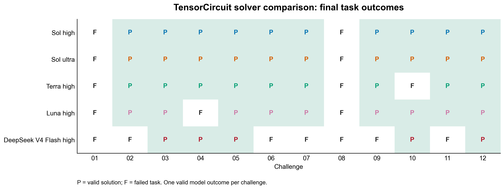
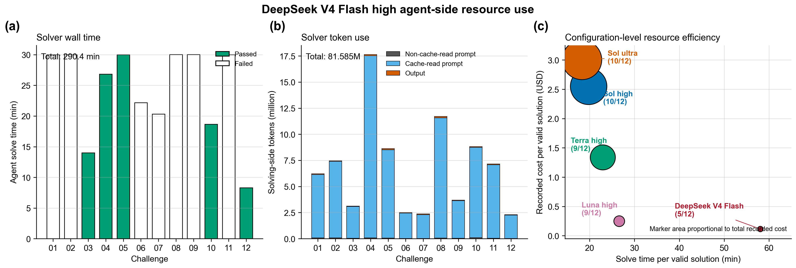

# DeepSeek V4 Flash High — TensorCircuit Benchmark

This directory archives one valid outcome for each of the 12 ORBIT-Q
TensorCircuit challenges. DeepSeek V4 Flash/high solved the tasks and GPT-5.6
Sol/high performed the independent source audit.

## Headline

- Final raw validity: **5 / 12**
- Functional checks: **7 / 12**
- Static policy checks: **7 / 12**
- Sol/high audit checks: **5 / 12**
- Passed challenges: **03, 04, 05, 10, and 12**

`P` denotes a valid solution and `F` a failed task. The matrix uses the same
task-level presentation as the archived ORBIT-Q GPT-5.6 benchmark reports.

## Protocol

- Run date: 2026-08-01 to 2026-08-02
- Branch: `codex/deepseek-v4-flash-high-benchmark`
- Base task commit: `0201238ec2983907e2891f5319f5fff2d00844d5`
- Solver: Harbor built-in Codex using the official DeepSeek integration,
  `deepseek-v4-flash`, reasoning effort `high`
- Auditor: Codex, `gpt-5.6-sol`, reasoning effort `high`
- Framework: TensorCircuit-NG
- Docker image: `challenge-benchmark-quantum-tensorcircuit:py311`
- Execution: Docker-isolated tasks, sequential order, one valid model outcome
  per challenge
- Local task resources: 6 CPUs, 10,240 MiB memory, 16,384 MiB storage

The solver saw only the public task instruction, TensorCircuit framework prompt,
and installed package source. It did not receive expert solutions, verifier
tests, or prior model outputs. The frozen task copies have aggregate SHA-256
`19fe27b83eaf668b3df32d1a68902b08cbe28585f189290769018eb16d927895`.
All 12 first attempts produced valid non-infrastructure outcomes; no task was
rerun.

## Results

| Challenge | Reward | Functional | Static | Sol audit | Runtime score | Runtime (s) | Outcome |
|---|---:|---:|---:|---:|---:|---:|---|
| 01 | 0.0 | 0.0 | 0.0 | 0.0 | 0.0 | — | Agent timeout |
| 02 | 0.0 | 0.0 | 0.0 | 0.0 | 0.0 | — | Agent timeout |
| 03 | 1.0 | 1.0 | 1.0 | 1.0 | 1.0 | 70.04 | Pass |
| 04 | 1.0 | 1.0 | 1.0 | 1.0 | 1.0 | 19.46 | Pass |
| 05 | 1.0 | 1.0 | 1.0 | 1.0 | 1.0 | 83.79 | Pass† |
| 06 | 0.0 | 1.0 | 1.0 | 0.0 | 1.0 | 54.79 | Audit fail |
| 07 | 0.0 | 1.0 | 1.0 | 0.0 | 0.882 | 194.15 | Audit fail |
| 08 | 0.0 | 0.0 | 0.0 | 0.0 | 0.0 | — | Agent timeout |
| 09 | 0.0 | 0.0 | 0.0 | 0.0 | 0.0 | — | Agent timeout |
| 10 | 1.0 | 1.0 | 1.0 | 1.0 | 1.0 | 20.50 | Pass |
| 11 | 0.0 | 0.0 | 0.0 | 0.0 | 0.0 | — | Agent timeout |
| 12 | 1.0 | 1.0 | 1.0 | 1.0 | 1.0 | 21.86 | Pass |
| **Total** | **5 / 12** | **7 / 12** | **7 / 12** | **5 / 12** | — | **464.59** | **5 / 12** |

† DeepSeek reached the 1,800-second Agent limit after writing the Task 05
candidate. Harbor then ran the unchanged normal verifier on that artifact and
awarded reward 1. Challenges 01, 02, 08, 09, and 11 timed out without a
submitted candidate.

## What failed

- **Challenge 06:** the candidate passed numerical checks, but used the uniform
  detuning operator `sum_i Z_i` instead of the required staggered
  `sum_i (-1)^i Z_i`. Sol/high therefore rejected the physical ansatz.
- **Challenge 07:** the forward values passed, but measurement probabilities
  were computed outside the differentiated objective and treated as constants.
  This omitted derivatives of trajectory normalization and produced a surrogate
  gradient rather than the gradient of the stated objective.
- **Challenges 01, 02, 08, 09, and 11:** the solver used the full 1,800-second
  Agent budget without submitting a candidate. These are valid model outcomes,
  not transport or Docker failures.

## Comparison

| Solver setting | Valid solutions | Failed challenges |
|---|---:|---|
| GPT-5.6 Sol high | 10 / 12 | 01, 08 |
| GPT-5.6 Sol ultra | 10 / 12 | 01, 08 |
| GPT-5.6 Terra high | 9 / 12 | 01, 08, 10 |
| GPT-5.6 Luna high | 9 / 12 | 01, 04, 08 |
| **DeepSeek V4 Flash high** | **5 / 12** | **01, 02, 06, 07, 08, 09, 11** |

DeepSeek's five accepted solutions form a strict subset of the Sol/high pass
set. The main loss is completion rate:
five tasks ended without a candidate, while two additional numerically passing
candidates were removed by independent source audit.

## Resource record

- Recorded Agent solve wall time: 17,424.73 seconds (4 h 50 min 25 s)
- Input tokens: 80.672 million, including 80.008 million cache-read tokens
- Output tokens: 0.913 million
- Total solving-side tokens: 81.585 million
- Recorded solver cost: USD 0.57
- Recorded cost per valid solution: USD 0.11

The low recorded dollar cost coexists with high token use and a lower pass
rate. Price and capability are separate dimensions; token volume alone does not
predict either task completion or final validity.

## Archived artifacts

Each `challenge-NN/` directory contains every artifact produced for that task:
candidate when present, official functional output, reward and audit details,
Harbor result/config/lock files, solver log, trial log, and normalized
`stamp-info.json`. `summary.json` is the machine-readable aggregate,
`model-comparison.json` records figure inputs, and `tools/` regenerates and
verifies the archive.
