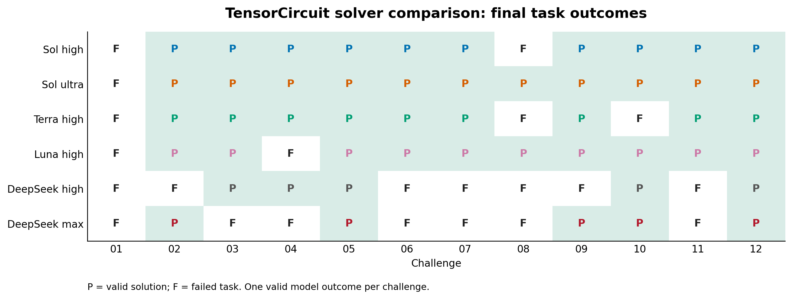
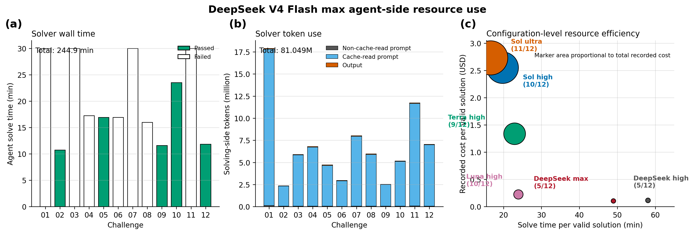

# DeepSeek V4 Flash Max — TensorCircuit Benchmark

This directory archives one valid outcome for each of the 12 ORBIT-Q
TensorCircuit challenges. DeepSeek V4 Flash/max solved the tasks and GPT-5.6
Sol/high performed the independent source audit.

## Headline

- Final raw validity: **5 / 12**
- Functional checks: **8 / 12**
- Static policy checks: **8 / 12**
- Sol/high audit checks: **5 / 12**
- Passed challenges: **02, 05, 09, 10, and 12**

`P` denotes a valid solution and `F` a failed task. The matrix follows the
task-level presentation used by the archived ORBIT-Q GPT-5.6 reports.

## Protocol

- Run date: 2026-08-02
- Branch: `codex/deepseek-v4-flash-max-benchmark`
- Base task commit: `0201238ec2983907e2891f5319f5fff2d00844d5`
- Solver: Harbor built-in Codex using the official DeepSeek integration,
  `deepseek-v4-flash`, reasoning effort `max`
- Auditor: Codex, `gpt-5.6-sol`, reasoning effort `high`
- Framework: TensorCircuit-NG
- Docker image: `challenge-benchmark-quantum-tensorcircuit:py311`
- Execution: Docker-isolated tasks, sequential order, one valid model outcome
  per challenge
- Local task resources: 6 CPUs, 10,240 MiB memory, 16,384 MiB storage

The solver saw only the public task instruction, TensorCircuit framework prompt,
and installed package source. It did not receive expert solutions, verifier
tests, or prior model outputs. The frozen task copies have aggregate SHA-256
`19fe27b83eaf668b3df32d1a68902b08cbe28585f189290769018eb16d927895`.
All first attempts were valid non-infrastructure outcomes; no task was rerun.

## Results

| Challenge | Reward | Functional | Static | Sol audit | Runtime score | Runtime (s) | Outcome |
|---|---:|---:|---:|---:|---:|---:|---|
| 01 | 0.0 | 0.0 | 0.0 | 0.0 | 0.0 | — | Agent timeout |
| 02 | 1.0 | 1.0 | 1.0 | 1.0 | 1.0 | 88.91 | Pass |
| 03 | 0.0 | 0.0 | 0.0 | 0.0 | 0.0 | — | Agent timeout |
| 04 | 0.0 | 1.0 | 1.0 | 0.0 | 1.0 | 6.30 | Audit fail |
| 05 | 1.0 | 1.0 | 1.0 | 1.0 | 1.0 | 77.44 | Pass |
| 06 | 0.0 | 1.0 | 1.0 | 0.0 | 1.0 | 25.16 | Audit fail |
| 07 | 0.0 | 0.0 | 0.0 | 0.0 | 0.0 | — | Agent timeout |
| 08 | 0.0 | 1.0 | 1.0 | 0.0 | 1.0 | 39.77 | Audit fail |
| 09 | 1.0 | 1.0 | 1.0 | 1.0 | 1.0 | 67.25 | Pass |
| 10 | 1.0 | 1.0 | 1.0 | 1.0 | 1.0 | 122.76 | Pass |
| 11 | 0.0 | 0.0 | 0.0 | 0.0 | 0.0 | — | Agent timeout |
| 12 | 1.0 | 1.0 | 1.0 | 1.0 | 1.0 | 15.16 | Pass |
| **Total** | **5 / 12** | **8 / 12** | **8 / 12** | **5 / 12** | — | **442.75** | **5 / 12** |

## What failed

- **Challenge 04:** the candidate applied the offset odd-bond channel to the two
  endpoints, although the specification excludes them, and allowed bond
  truncation in a calculation that must remain exact.
- **Challenge 06:** the candidate used the uniform detuning operator
  `sum_i Z_i` instead of the required staggered `sum_i (-1)^i Z_i`.
- **Challenge 08:** both edge-angle indices were shifted by one, and the core
  contraction used a one-dimensional MPS rather than the required direct 2D
  grid tensor network.
- **Challenges 01, 03, 07, and 11:** the solver used the full 1,800-second Agent
  budget without submitting a candidate. These are valid model outcomes, not
  transport or Docker failures.

## Comparison

| Solver setting | Valid solutions | Failed challenges |
|---|---:|---|
| GPT-5.6 Sol high | 10 / 12 | 01, 08 |
| GPT-5.6 Sol ultra | 11 / 12 | 01 |
| GPT-5.6 Terra high | 9 / 12 | 01, 08, 10 |
| GPT-5.6 Luna high | 10 / 12 | 01, 04 |
| DeepSeek V4 Flash high | 5 / 12 | 01, 02, 06, 07, 08, 09, 11 |
| **DeepSeek V4 Flash max** | **5 / 12** | **01, 03, 04, 06, 07, 08, 11** |

High and max both reached 5/12, but with different accepted sets. They overlap
on Challenges 05, 10, and 12; max adds 02 and 09, while high adds 03 and 04.
Max produced eight functionally passing candidates versus seven for high, but
three were removed by source audit, leaving final validity unchanged. Because
each setting has one outcome per task, the task-level swap should not be read as
a stable ranking between reasoning efforts.

## Resource record

- Recorded Agent solve wall time: 14,692.62 seconds (4 h 4 min 53 s)
- Input tokens: 80.371 million, including 79.595 million cache-read tokens
- Output tokens: 0.678 million
- Total solving-side tokens: 81.049 million
- Recorded solver cost: USD 0.52
- Recorded cost per valid solution: USD 0.10

Max used less solver wall time, fewer output tokens, and slightly less recorded
cost than high in these single runs, while achieving the same 5/12 final
validity. Price and token volume remain separate from correctness.

## Archived artifacts

Each `challenge-NN/` directory contains every artifact produced for that task:
candidate when present, official functional output, reward and audit details,
Harbor result/config/lock files, solver log, trial log, and normalized
`stamp-info.json`. `summary.json` is the machine-readable aggregate,
`model-comparison.json` records figure inputs, and `tools/` regenerates and
verifies the archive.
