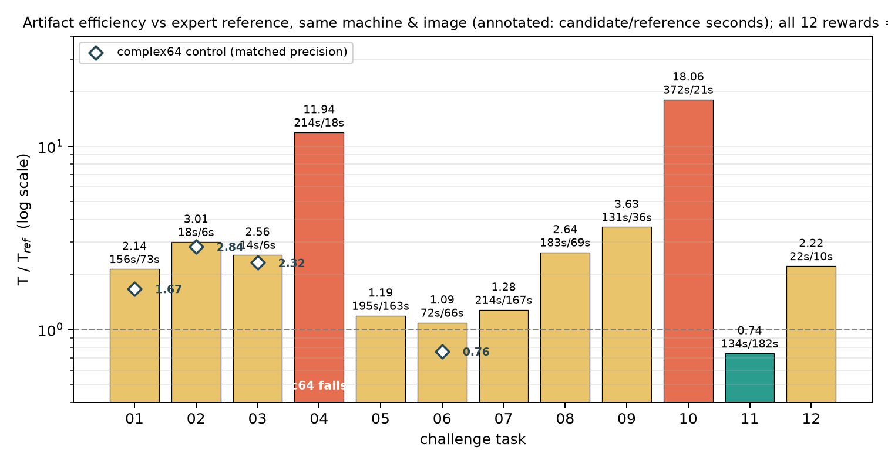
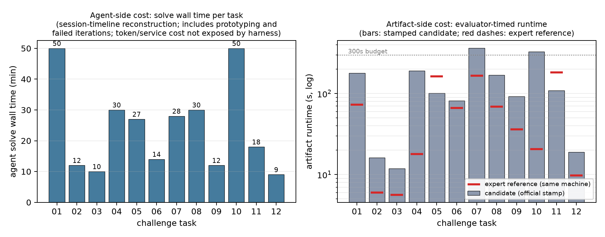

# Fable 5 × ORBIT-Q 基准测试报告（半官方混合流程）

日期：2026-07-27 ~ 2026-07-28 · 求解模型：Fable 5（Cursor Agent）· 框架：TensorCircuit-NG
最终结果：**12/12 题官方 reward = 1.0**（functional × static × LLM audit 全满分）· T/T_ref 中位数 **2.39**（最好 0.74，最差 18.06）




图表口径(对齐上游 README Main Results 的两图结构):第一张为产物效率
(官方比值柱 + complex64 同精度对照菱形);第二张为资源消耗——左侧 agent 求解
墙钟时间(会话时间线重建,总计约 290 分钟;Cursor harness 不暴露 token/服务
成本,故如实缺省),右侧为官方盖章的产物运行时长与同机专家参考对照。

## 一、混合流程是怎么运作的

本轮采用"半官方"混合流程：**验证侧完全官方，求解侧用 Cursor Agent 替代容器内 agent**。

```text
云端 Linux VM（求解 + 预检）                Mac（官方盖章）
─────────────────────────────            ─────────────────────────────
1. Fable 5 读题（只读 instruction.md        5. Codex 拉取分支，运行
   与 prompts/frameworks/*.md）              verify_challenge_mac.sh NN：
2. 在基准镜像容器里原型验证、写               Harbor verifier-only 路径 =
   solution_N.py、按题面自写 harness 自测      官方 test.sh（功能评测 + 静态
3. 云端预检：官方 test.sh 原样执行             策略 + Codex LLM 审计，审计
   （功能 + 静态；无 OpenAI 凭据故审计缺项）      模型 gpt-5.6-sol，凭据来自
4. 解冻结后测参考解同机耗时，算 T/T_ref，        本机 ~/.codex/auth.json）
   连同解与预检产物提交 git 分支    ──────►  6. reward.json 回写同一分支
```

与论文原版协议的差异（已在 README.md 声明）：

- **求解 harness 不同**：官方 agent-axis 在 Harbor 求解容器内运行 codex/claude CLI，容器内物理上不存在 `tests/` 和 `solution/`；本流程中 Fable 5 直接操作仓库工作区，隔离靠纪律协议（见下）而非物理隔离。因此 agent 侧资源指标（token、求解墙钟）与论文不可比；**产物侧指标（通过率、审计、runtime、T/T_ref）与论文同规可比**。
- **防污染纪律**：解题只读题面与框架提示词，从不打开 `tests/`（判分器）与 `solution/`（参考答案）；参考解只执行计时、从不读源码，且一律在候选解冻结（git 提交）之后执行；全程操作留有可审查的工具调用记录。唯一例外：用户报告计分 bug 后，定向读过 `score_submission.py` 的奖励聚合 20 行（非功能评测器，时点在 01–06 已解完之后）。
- **T/T_ref 协议**：绝对时间与硬件绑定，论文口径的效率指标是同机同镜像下"候选解耗时 / 出版参考解耗时"。逐题的测量出处与历史记录在 `challenge-NN/runtime-comparison.json`。

## 二、过程中发现并修复的基准基础设施问题

1. **omeco 版本错位**：requirements 钉死的 `tensorcircuit-nightly 1.7.0.dev20260618` 早于 `set_contractor("omeco")` 进入上游 master，导致官方参考解（01/05）在公开镜像跑不了。升级钉到 `1.8.0.dev20260726` 后全部参考解原样可跑，且已完成四题在新环境下全部重测保持 functional 1.0。
2. **计分器与文档脱钩**：`ea088db`（07-01）在 AGENTS.md/README 声明"runtime 不参与 reward"，但 `score_submission.py`（模板 + 12 份副本）仍在乘 `runtime_score`——challenge-04 曾因此在三项门槛全满分下只得 0.8646（恰为运行时插值 (300−196.25)/120）。已同步修复（模板与副本逐字节一致），并以独立分支向上游提 PR。修复后 runtime 只记录不扣分（c07 官方 365s、c10 官方 330s 均满分）。

## 三、逐题观察

| 题 | 主题 | 官方 runtime | T/T_ref | 解题要点与观察 |
| ---: | --- | ---: | ---: | --- |
| 01 | DMRG-MPS 输入 + 变分精修 | 178.5s | 2.14 | 32 比特必须走 MPSCircuit；quimb→TC 张量转换用 `permute_arrays("lpr")`；能量必须用归一化期望——截断范数流失会假性抬高能量，未归一化时净改善为负 |
| 02 | 纠缠熵剖面约束 VQE | 16.1s | 3.01 | 熵检查点用框架 `reduced_density_matrix`/`renyi_entropy`；第三检查点熵停在 0.26 而非目标 0.8：基态附近能量项收益压过 0.25 权重的熵罚，是规定损失的真实最优 |
| 03 | 概率感知后选择冷却 | 11.9s | 2.54 | `post_select` 输出不归一化、范数平方即分支概率；初始成功率 ≈ 0.5⁶（首轮坍缩后后续事件概率趋近 1）；参考解最终指标与我方逐位一致，佐证协议对齐 |
| 04 | 可训练 Kraus 信道校准 | 191.1s | 11.94 | **唯一被审计打回的题**：v1 用裸 tn.Node 手搭 Kraus 梯子网络（数值上与 NumPy 暴力密度矩阵一致）被判 raw-simulator bypass；v2 改为 MPSCircuit 上的向量化密度矩阵模拟（ket/bra 交错 24 站点，信道 = ΣK⊗K* 超算符经 `any` 作用），数值与 v1 一致到 3e-15 但慢 4 倍——"合规性税"的直接量化 |
| 05 | 非幺正门冷却 | 101.2s | 1.19 | e^{aX}/e^{bZZ} 滤波器矩阵按题面构造、经框架门接口作用；偶数层键覆盖全部比特，门级合成省 2.8 倍操作；容器时钟跳变污染 time.time()，改单调时钟后确认真实耗时 |
| 06 | 数字-模拟混合 VQE | 81.7s | 1.09 | 框架原生 `ode_evol_global` 满足"真 ODE 积分器"要求；`ode_max_steps=16` 语义选 jaxode 的 mxstep（稳健截断）而非 diffrax（超限抛异常）；归一化期望保证能量不破基态下界 |
| 07 | 测量反馈 VQE | 365.4s | 1.28 | `cond_measure(status=u)` 可 jit 可 vmap，固定 64×2×8 均匀数保证轨迹可复现；涌现现象：优化器把协议练成测量不敏感（64 轨迹能量 std 3e-4）；c128+remat 465s 超时 → c64+免 remat 213s |
| 08 | 7×7 网格 TN 采样 | 169.4s | 2.64 | `Circuit.sample(allow_state=False)` 直接从电路网络完美采样，49 单点 Z 与多组串和精确收缩对拍全部吻合；默认收缩器会物化全态矢（17GB OOM），需 `reuse=False` + omeco；采样是批量向量化的，成本大头在路径搜索 |
| 09 | 512 比特光锥优化 | 92.0s | 3.63 | 从 gate_tape 反向传播支撑集提取因果锥（18/15 比特，与官方锥尺寸一致）；两锥参数零重叠 + Adam 逐坐标 → 全向量优化严格解耦；200 重启全部收敛到解析最大值 1.56459 |
| 10 | 18 比特 CZ 超边 VQE | 330.4s | **18.06** | CZ 超边用 `multicontrol`（MPO 形式）表达；22 比特下稀疏 Pauli 和有 2.9GB 被 JIT 捕获成常量导致 OOM（改 bond-3 MPO 能量）；贪心收缩器在 MPO 三明治上卡死（改 omeco）；全套最大效率差距——专家实现对超边有 18 倍更优的处理 |
| 11 | 自旋-1 Haldane 链 + 弦序 | 109.3s | **0.74** | `QuditCircuit(dim=3)` 原生三能级模拟；旋转用自旋-1 闭式指数（Sy³=Sy）；弦序 MAE 0.064（容差 0.12），变分态真实呈现 Haldane 非局域序。**同精度胜出**：事后核查（仅配置行）确认参考解同为 complex64，134s vs 177–182s 是等精度下 1.35 倍的真实实现优势（c128 对照 199s 仅刻画自身精度缩放） |
| 12 | 电路-MPS 重叠优化 | 18.9s | 2.22 | SU4 = 15 个 su(4) Pauli 生成元的 expm；目标 MPS 装载为框架张量、重叠用 `proj_with_mps`（未转制备电路）；初始保真度 1.9e-9 是协议固有（交错场把目标钉在相反 Néel 型），5000 步后 0.8699 过 0.85 阈值 |

## 四、横向结论

1. **有效性轴**：12/12 官方满分。一次审计打回（c04）暴露并校准了"框架原生"的边界——tn.Node 手搭演化不行，测量侧收缩可以；重写后通过，且这条边界经验使后续 8 题零返工。
2. **效率轴**：官方口径 T/T_ref 中位数 2.39；同精度校正后（可比 11 题）中位数约 2.2。分区：**等精度反超专家**（06:0.76、11:0.74）；接近专家（05/07：1.19–1.28）；2–3 倍常规差距（01/02/03/08/09/12，同精度后 1.67–3.63，主要是 XLA 编译/收缩路径开销）；极端差距（04：11.9，其中含单精度不可达的算法性精度需求差；10：18.1，超边处理）。
   **T/T_ref 的精度归因（事后核查 + 同精度对照实验）**：全轮结束、12 题全部冻结盖章后，先做了范围严格限定的核查——仅提取各参考解的 `set_dtype` 配置行（不读算法内容）：**12 份参考解全部使用 complex64**。随后对五个错配题（我方官方解为 c128）各跑了一个 c64 对照变体过官方功能评测：

   | 题 | 官方解(c128) | c64 对照 | 功能评测 | 参考(c64) | 官方比值 | **同精度比值** |
   | ---: | ---: | ---: | :---: | ---: | ---: | ---: |
   | 01 | 156.0s | 121.9s | PASS | 72.8s | 2.14 | **1.67** |
   | 02 | 18.1s | 17.1s | PASS | 6.0s | 3.01 | **2.84** |
   | 03 | 14.3s | 13.0s | PASS | 5.6s | 2.56 | **2.32** |
   | 04 | 213.7s | 202.9s | **FAIL** | 17.9s | 11.94 | 不可达 |
   | 06 | 72.2s | 50.6s | PASS | 66.5s | 1.09 | **0.76** |

   三个发现：(a) **c06 在同精度下也反超参考解（0.76）**——加上 c11 的 0.74，12 题中有两题的产物在等精度下快于专家实现；(b) **c04 的 c64 对照功能失败**：单精度下向量化密度矩阵方法无法把信道参数拟合进 2e-4 容差，而参考解在 c64 下能通过——11.94 的比值中包含两种算法对精度需求的真实差异，而非单纯的实现慢；(c) 编译主导的题（02/03）换精度几乎不动（收益 5–9%），说明其比值反映的是 XLA 编译/路径开销而非算术精度。官方记录（已盖章的 c128 解及其比值）保持不变，对照数据记录于各题 `runtime-comparison.json` 的 `matched_precision_control` 字段，条形图上以菱形标记呈现。
3. **工程观察**：几乎每题都有一个"数值正确性之外"的工程关口——收缩路径（08/10）、JIT 常量捕获（10）、AD 显存（04/07）、SVD 微分稳定性（01）、时钟可靠性（05）。框架协同性能的真实瓶颈往往在这些地方，而非物理建模。
4. **待办**：用 Harbor 内置 `cursor_cli` 适配器做第二轮容器内对比（物理隔离 + agent 侧资源指标可比），与本轮形成 harness 对照。

## 五、产物索引

- 总表：`summary.md` · 逐题目录：`challenge-NN/`（解、云端预检、官方盖章、参考对拍、耗时比值、审计溯源）
- 图表：`figs/`（本报告两图）· 生成脚本：`tools/make_figures.py`
- 工具：`tools/verify_challenge_mac.sh`（Mac 官方盖章）· `tools/proxy_relay.py`（审计网络中继）
