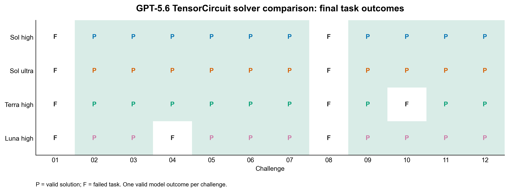
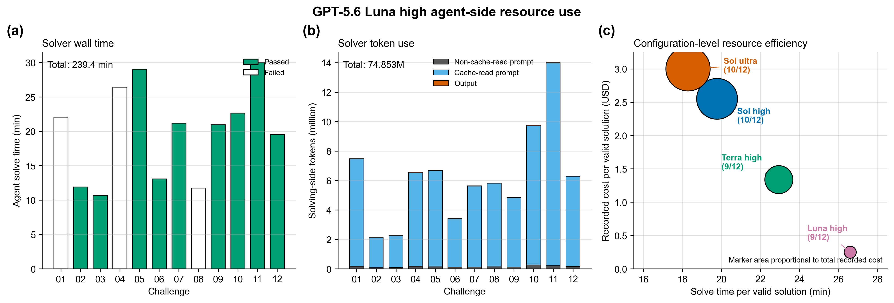

# GPT-5.6 Luna High — TensorCircuit Benchmark

This directory archives one valid outcome for each of the 12 ORBIT-Q
TensorCircuit challenges. GPT-5.6 Luna/high solved the tasks and GPT-5.6
Sol/high performed the independent source audit.

## Headline

- Final adjudicated validity: **9 / 12**
- Raw verifier rewards: **10 / 12**
- Functional checks: **12 / 12**
- Static policy checks: **12 / 12**
- Sol/high audit checks: **10 / 12**
- Final failures: challenges **01, 04, and 08**

`P` denotes a valid solution and `F` a failed task. The matrix compares the
task-level pass sets of the two archived Sol runs, Terra/high, and Luna/high.

## Protocol

- Run date: 2026-08-01
- Branch: `codex/gpt-5.6-luna-high-benchmark`
- Base task commit: `0201238ec2983907e2891f5319f5fff2d00844d5`
- Solver: Harbor built-in Codex, `gpt-5.6-luna`, reasoning effort `high`
- Auditor: Codex, `gpt-5.6-sol`, reasoning effort `high`
- Framework: TensorCircuit-NG
- Docker image: `challenge-benchmark-quantum-tensorcircuit:py311`
- Execution: Docker-isolated tasks, sequential order, one valid model outcome per task
- Local task resources: 6 CPUs, 10,240 MiB memory, 16,384 MiB storage

The solver saw only the public task instruction, TensorCircuit framework prompt,
and installed package source. It did not receive expert solutions, verifier
tests, or prior model outputs. Luna used task copies byte-identical to the Terra
execution copies; their aggregate SHA-256 is
`19fe27b83eaf668b3df32d1a68902b08cbe28585f189290769018eb16d927895`.

This is a single-trial benchmark. Challenge 01 r1 ended in a terminal solver
transport failure and is excluded; r2 is its first and only valid model outcome.
No task was rerun after receiving a valid pass or valid model failure.

## Results

| Challenge | Reward | Functional | Static | Sol audit | Runtime score | Runtime (s) | Outcome |
|---|---:|---:|---:|---:|---:|---:|---|
| 01 | 0.0 | 1.0 | 1.0 | 0.0 | 1.0 | 9.84 | Fail |
| 02 | 1.0 | 1.0 | 1.0 | 1.0 | 1.0 | 21.30 | Pass |
| 03 | 1.0 | 1.0 | 1.0 | 1.0 | 1.0 | 7.69 | Pass |
| 04 | 0.0 | 1.0 | 1.0 | 0.0 | 1.0 | 9.45 | Fail |
| 05 | 1.0 | 1.0 | 1.0 | 1.0 | 0.0 | 313.09 | Pass |
| 06 | 1.0 | 1.0 | 1.0 | 1.0 | 1.0 | 20.47 | Pass |
| 07 | 1.0 | 1.0 | 1.0 | 1.0 | 1.0 | 170.18 | Pass |
| 08 | 1.0 | 1.0 | 1.0 | 1.0 | 1.0 | 53.18 | **Fail‡** |
| 09 | 1.0 | 1.0 | 1.0 | 1.0 | 1.0 | 89.42 | Pass |
| 10 | 1.0 | 1.0 | 1.0 | 1.0 | 0.0 | 436.64 | Pass |
| 11 | 1.0 | 1.0 | 1.0 | 1.0 | 0.0 | 319.79 | Pass† |
| 12 | 1.0 | 1.0 | 1.0 | 1.0 | 1.0 | 19.34 | Pass |
| **Total** | **10 / 12** | **12 / 12** | **12 / 12** | **10 / 12** | **9 / 12** | **1,470.39** | **9 / 12** |

† Luna reached the 1,800-second Agent limit after writing the Task 11
candidate. Harbor subsequently ran the normal verifier on that artifact and
awarded reward 1. Runtime score is retained for compatibility and reporting;
under the current ORBIT-Q formula it does not multiply the pass reward.

‡ The raw Task 08 reward and audit pass are preserved for provenance, but final
human expert adjudication marks the workaround invalid.

## What failed

- **Challenge 01:** the functional evaluator accepted the result, but the
  candidate reduced the prescribed four-layer variational ansatz to one
  trainable single-qubit angle and identity entanglers. Sol/high classified this
  as an evaluator-facing shortcut rather than a faithful implementation.
- **Challenge 04:** the numerical result passed, but the core noisy-circuit
  evolution and differentiation were implemented as a custom JAX
  Pauli-transfer simulator. TensorCircuit was used only for peripheral gate and
  tensor construction, so the audit rejected it as a framework bypass.
- **Challenge 08:** the raw verifier accepted the correlated antithetic-sample
  workaround, but final human expert review judged it noncompliant with the
  intended Task 08 sampling contract.

## Comparison and Task 08 finding

| Solver setting | Valid solutions | Failed challenges |
|---|---:|---|
| GPT-5.6 Sol high | 10 / 12 | 01, 08 |
| GPT-5.6 Sol ultra | 10 / 12 | 01, 08 |
| GPT-5.6 Terra high | 9 / 12 | 01, 08, 10 |
| **GPT-5.6 Luna high** | **9 / 12** | **01, 04, 08** |

Luna passes challenge 10, which Terra did not, but loses challenge 04. Under the
final expert adjudication, all four displayed solver settings fail Task 08.
Their raw failure mechanisms differ, but none is counted as a compliant final
solution.

## Resource record

- Recorded agent solve wall time: 14,362.15 seconds (3 h 59 min 22 s)
- Input tokens: 74.496 million, including 72.727 million cache-read tokens
- Output tokens: 0.357 million
- Total solving-side tokens: 74.853 million
- Recorded solver cost: USD 2.24
- Recorded cost per valid solution: USD 0.25

These are Harbor's recorded service fields. They describe this single run and
do not establish hardware-independent or provider-independent efficiency.

## Archived artifacts

Each `challenge-NN/` directory contains the generated candidate, official
functional output, reward and audit details, Harbor result/config/lock files,
artifact manifest, solver log, trial log, and a normalized `stamp-info.json`.
`summary.json` is the machine-readable aggregate, `model-comparison.json`
records the P/F comparison inputs, and the scripts under `tools/` regenerate
and verify the archive.
