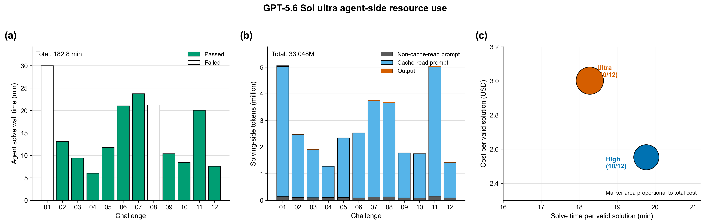
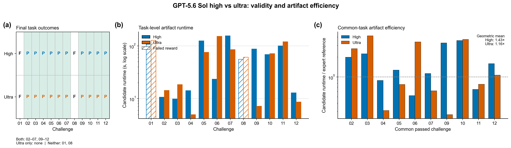
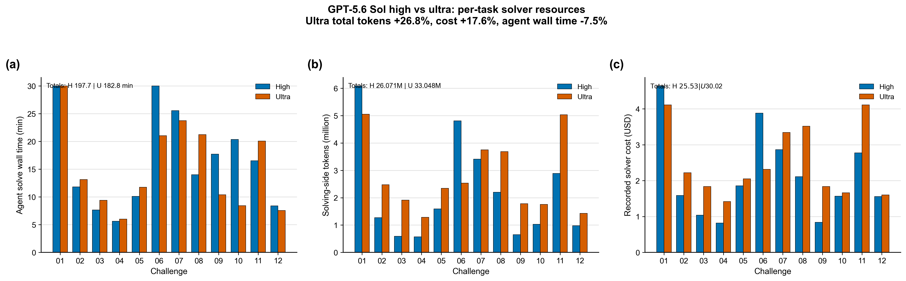

# GPT-5.6 Sol Ultra — Clean TensorCircuit Benchmark

This directory contains one freshly solved Harbor trial for each of the 12
ORBIT-Q TensorCircuit challenges, plus a solver-effort comparison against the
previous GPT-5.6 Sol `high` run.

## Headline

- Final adjudicated validity: **10 / 12**
- Raw verifier rewards: **10 / 12**
- Functional checks: **12 / 12**
- Static policy checks: **12 / 12**
- Raw audit checks: **10 / 12**

Challenges 01 and 08 are the final failures. Challenge 07's original audit
failure is retained as a raw artifact but was overturned by a later exact
source-level adjudication. Challenge 08's original reward and audit pass are
also retained, but the final expert adjudication marks the solution invalid.

## Protocol

- Run date: 2026-07-28
- Clean branch: `codex/gpt-5.6-sol-ultra-clean-benchmark`
- Base commit: `0201238ec2983907e2891f5319f5fff2d00844d5`
- Solver agent: Harbor built-in Codex
- Solver model: `gpt-5.6-sol`
- Solver reasoning effort: `ultra`
- Audit model: `gpt-5.6-sol`
- Audit reasoning effort: `high`
- Framework: TensorCircuit-NG / `tensorcircuit-nightly`
- Docker image: `challenge-benchmark-quantum-tensorcircuit:py311`
- Image ID:
  `sha256:b059c5fa7f75702f9afbf94ec7866e102ac32afd59d25634ec0aca0fd56e2833`
- Container architecture: `linux/arm64`
- Codex CLI in image: `0.145.0`
- Trials per challenge: 1
- Harbor retries: 0
- Execution order: challenge 01 through challenge 12, sequentially

The audit effort remained fixed at `high` in both the prior `high` solver run
and this `ultra` solver run. Thus the effort comparison changes the solver
effort only.

The canonical `tasks/challenge-*` files were not edited. All tasks were copied
fresh from the base commit into:

```text
/private/tmp/orbitq-gpt56sol-ultra-clean-20260728.4vqkrt
```

Only the local resource declaration was adapted to match the previous high-run
protocol: 6 CPUs, 10,240 MiB memory, and 16,384 MiB storage. A recursive
comparison found zero mismatches between these execution copies and the
previous high protocol copies. The aggregate task-copy SHA-256 was:

```text
c404ed272d55d85b23820182781ae8f43299c3409bf5c254624f49a33884d66a
```

## Ultra results

| Challenge | Raw reward | Functional | Static | Raw audit | Final validity | Runtime (s) |
|---|---:|---:|---:|---:|---:|---:|
| 01 | 0.0 | 1.0 | 1.0 | 0.0 | Fail | 127.87 |
| 02 | 1.0 | 1.0 | 1.0 | 1.0 | Pass | 14.32 |
| 03 | 1.0 | 1.0 | 1.0 | 1.0 | Pass | 18.45 |
| 04 | 1.0 | 1.0 | 1.0 | 1.0 | Pass | 4.96 |
| 05 | 1.0 | 1.0 | 1.0 | 1.0 | Pass | 75.51 |
| 06 | 1.0 | 1.0 | 1.0 | 1.0 | Pass | 152.16 |
| 07 | 0.0 | 1.0 | 1.0 | 0.0 | **Pass†** | 84.99 |
| 08 | 1.0 | 1.0 | 1.0 | 1.0 | **Fail‡** | 60.94 |
| 09 | 1.0 | 1.0 | 1.0 | 1.0 | Pass | 7.18 |
| 10 | 1.0 | 1.0 | 1.0 | 1.0 | Pass | 71.27 |
| 11 | 1.0 | 1.0 | 1.0 | 1.0 | Pass | 120.07 |
| 12 | 1.0 | 1.0 | 1.0 | 1.0 | Pass | 8.61 |
| **Total / mean** | **10 / 12** | **12 / 12** | **12 / 12** | **10 / 12** | **10 / 12** | **62.19 mean** |

† Post-hoc source adjudication; the original reward and audit files remain
unchanged.

‡ Post-hoc expert adjudication; the raw Task 08 reward and audit files remain
unchanged for provenance.

The 12 solution runtimes total 746.33 seconds.

## Audit findings and adjudication

- Challenge 01: the candidate capped the MPS bond dimension after two-qubit
  gates. The audit judged this unrequested truncation to change the prescribed
  unitary ansatz and objective. The candidate had already been written when the
  solver reached its 1,800-second limit, so Harbor still verified it.
- Challenge 07: the raw audit rejected the candidate because it analytically
  sampled the branches once and reused them. The later exact reduction study
  showed that this is a false negative for the published workload. Only the
  ancilla `RY` angles affect the measurement distribution; their pathwise
  gradient through fixed discrete samples is zero, so they do not update and
  the realized branches remain unchanged. Reusing those branches therefore
  preserves the benchmark trajectory. The proof and evidence are summarized
  in [`challenge-07/adjudication.md`](challenge-07/adjudication.md).
- Challenge 08: the raw verifier accepted the candidate, but the final human
  expert review judged the workaround noncompliant with the intended Task 08
  sampling contract. It is therefore counted as a final failure.

Challenges 01 and 08 are failed. Challenge 07 is adjudicated to pass. These
final adjudications do not alter the original `reward.json` or
`audit-details.json` files.

## High versus ultra solver effort

The high run's challenge 05 audit was a documented false negative: the audit
incorrectly claimed direct TensorCircuit `exp1` uses a half-angle convention.
In the pinned package, `exp1` defaults to `half=False`; only named rotations
such as `rxx` and `rzz` opt into `half=True`. Source inspection and direct
matrix checks therefore established that high challenge 05 is valid.

The comparable final result is **10/12 for high and 10/12 for ultra**. Their
final pass sets are identical:

| Challenge | High final | Ultra final | High runtime (s) | Ultra runtime (s) | Ultra − high (s) |
|---|---:|---:|---:|---:|---:|
| 01 | Fail | Fail | 107.51 | 127.87 | +20.36 |
| 02 | Pass | Pass | 10.65 | 14.32 | +3.67 |
| 03 | Pass | Pass | 9.84 | 18.45 | +8.61 |
| 04 | Pass | Pass | 14.14 | 4.96 | -9.18 |
| 05 | Pass | Pass | 124.92 | 75.51 | -49.41 |
| 06 | Pass | Pass | 23.39 | 152.16 | +128.77 |
| 07 | Pass | Pass† | 155.52 | 84.99 | -70.53 |
| 08 | Fail | Fail‡ | 55.48 | 60.94 | +5.46 |
| 09 | Pass | Pass | 87.31 | 7.18 | -80.13 |
| 10 | Pass | Pass | 68.68 | 71.27 | +2.59 |
| 11 | Pass | Pass | 100.41 | 120.07 | +19.66 |
| 12 | Pass | Pass | 12.85 | 8.61 | -4.24 |

† Post-hoc source adjudication. ‡ Post-hoc expert adjudication.

The overlap is:

- both passed: challenges 02, 03, 04, 05, 06, 07, 09, 10, 11, and 12;
- high only: none;
- ultra only: none;
- neither: challenges 01 and 08.

### Solution-strategy findings

Challenge 01 is a shared failure. Both solutions use TensorCircuit MPS
evolution and cap the bond dimension at `dmrg_chi` after two-qubit gates. This
unrequested truncation changes the specified unitary ansatz. Ultra did not
avoid the semantic shortcut taken by high.

Challenge 07 is passed by both efforts. High keeps measurement inside the
trajectory objective. Ultra recognizes an exact property of the published
circuit: the fixed-discrete-sample pathwise gradient of the ancilla sampling
angles is zero, so those angles and the realized branches do not change during
optimization. Its analytic branch reuse is therefore an exact workload
reduction, not a fixed-branch surrogate with different dynamics.

Challenge 08 is failed by both efforts under final expert adjudication. High
uses correlated Sobol quasi-samples rather than ordinary circuit samples.
Ultra builds row-triple proposals and applies Metropolis-Hastings correction,
but the final expert review likewise rejects that workaround under the intended
Task 08 sampling contract.

Challenge 05 is not a solver difference. Both candidates use direct
`exp1(theta=1j*...)`, which is the correct full-angle convention in the pinned
TensorCircuit package.

Overall, high and ultra each finish at 10/12 with the same final pass set.

## Figures



The standalone ultra resource figure follows the layout used for the high run:
task-level Agent wall time, prompt/cache/output token composition, and
time-versus-cost per valid solution.



The outcome figure shows identical final pass sets. It compares both raw
artifact runtime and same-reference runtime ratios on the ten tasks passed by
both efforts.



The resource comparison shows task-level Agent wall time, total solving-side
tokens, and recorded solver cost.

### Resource comparison

| Metric | High | Ultra | Ultra − high |
|---|---:|---:|---:|
| Final valid solutions | 10 | 10 | 0 |
| Agent solve wall time | 197.70 min | 182.80 min | -7.5% |
| Non-cache input tokens | 1.709 M | 1.312 M | -23.2% |
| Cache-read input tokens | 24.199 M | 31.478 M | +30.1% |
| Output tokens | 0.163 M | 0.257 M | +58.1% |
| Total solving-side tokens | 26.071 M | 33.048 M | +26.8% |
| Recorded cost | USD 25.53 | USD 30.02 | +17.6% |
| Cost per valid solution | USD 2.55 | USD 3.00 | +17.6% |
| Solve time per valid solution | 19.77 min | 18.28 min | -7.5% |
| All-artifact runtime total | 770.70 s | 746.33 s | -3.2% |

Ultra consumed substantially more total and output tokens and cost more, while
its recorded agent wall time was shorter and final validity was unchanged.

For the ten tasks passed by both runs (02–07 and 09–12), the geometric mean of
`ultra_runtime / high_runtime` is 0.815. Against the shared expert references,
the geometric-mean ratios are 1.428× for high and 1.165× for ultra. Their
arithmetic runtime totals are 557.52 seconds for ultra and 607.71 seconds for
high. These runtime results compare the generated programs, not the reasoning
service itself.

This is only one trial per task. It supports a cost/behavior observation, not a
strong claim that one effort level is generally more capable or faster.

## Contamination audit

No evidence of high-run contamination was found:

- all 12 solver configs point to the fresh temporary task root;
- `resume_trajectory=false`;
- no solver skills or MCP servers were loaded;
- no host result or scratch directory was mounted;
- case-insensitive searches of every solver transcript found zero references
  to the high branch, high results directory, high audit adjudication, host
  `jobs/`, or `.scratch/`;
- the branch and task copies started from the same pre-high base commit.

Inspecting the installed TensorCircuit package source and examples was explicitly
allowed by the framework prompt. This explains how a solver can learn the
correct `exp1` API directly from its environment; it is not prior-run leakage.
The detailed checks and zero-match counts are in `contamination-audit.json`.

In particular, ultra did not "fix high's angle mistake." There was no angle
mistake in the high candidate. The original high audit made the mistake by
assuming the wrong `exp1` convention. Ultra's separate audit correctly accepted
the same direct-`exp1`, `theta=1j*...` convention.

## Archived artifacts

Each `challenge-NN/` directory contains:

- `solution_N.py`: the generated candidate;
- `functional-stdout-official.txt`: main-run functional evaluator output;
- `reward.json`: final machine-readable score;
- `audit-details.json`: static, functional, and Codex audit details;
- `job-result.json`: Harbor result data;
- `stamp-info.json`: task, model, effort, resource, timing, token, cost, hash,
  and final score metadata.

Harbor's artifact sanitizer replaced the ordinary `true` identifier fragment
inside the collected challenge 04 source. The archived `solution_4.py` restores
the four unambiguous identifiers (`true_probabilities`, `true_p01`, and
`true_p10`) so it matches the valid source executed by the verifier.

Some verbatim audit files contain literal `[REDACTED]` tokens inserted by
Harbor and are therefore not strict JSON. Machine-readable scores and summaries
are in `reward.json`, `agent-resource-use.json`, and
`effort-comparison.json`. The three figures are regenerated by
`tools/make_figures.py`; the normalized summary data are regenerated by
`tools/rebuild_clean_data.mjs`.
