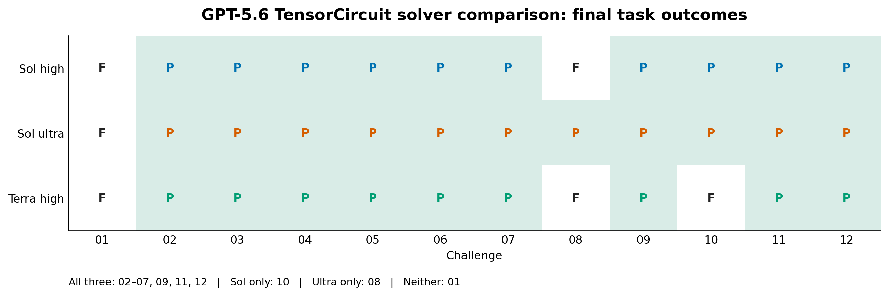
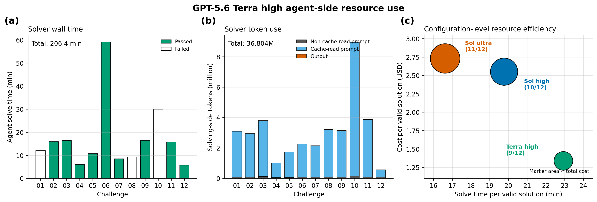

# GPT-5.6 Terra High — TensorCircuit Benchmark

This directory archives one valid outcome for each of the 12 ORBIT-Q
TensorCircuit challenges. GPT-5.6 Terra/high solved the tasks; GPT-5.6 Sol/high
performed the independent source audit.

## Headline

- Final validity: **9 / 12**
- Functional checks: **9 / 12**
- Static policy checks: **11 / 12**
- Sol/high audit checks: **9 / 12**
- Valid failures: challenges **01, 08, and 10**

The matrix compares the task-level pass sets for the two archived Sol runs and
the new Terra run. `P` denotes a valid solution and `F` denotes a failed task;
all failure mechanisms are intentionally collapsed into the same outcome here.

## Protocol

- Run dates: 2026-07-31 to 2026-08-01
- Branch: `codex/gpt-5.6-terra-high-benchmark`
- Base task commit: `0201238ec2983907e2891f5319f5fff2d00844d5`
- Solver: Harbor built-in Codex, `gpt-5.6-terra`, reasoning effort `high`
- Auditor: Codex, `gpt-5.6-sol`, reasoning effort `high`
- Framework: TensorCircuit-NG
- Docker image: `challenge-benchmark-quantum-tensorcircuit:py311`
- Execution: Docker-isolated tasks, sequential order, one valid outcome per task
- Local task resources: 6 CPUs, 10,240 MiB memory, 16,384 MiB storage
- Harbor retry count for a valid model outcome: 0

The solver received the public task instruction and TensorCircuit framework
prompt inside the benchmark container. It did not receive the expert solution,
the verifier tests, or prior model outputs. Canonical task files were copied
from the base commit; only the three local resource fields were adapted. The
aggregate execution-copy SHA-256 is
`19fe27b83eaf668b3df32d1a68902b08cbe28585f189290769018eb16d927895`.
Per-task hashes are in `task-copy-manifest.json`.

## Results

| Challenge | Reward | Functional | Static | Sol audit | Runtime (s) | Outcome |
|---|---:|---:|---:|---:|---:|---|
| 01 | 0.0 | 0.0 | 1.0 | 0.0 | — | Fail |
| 02 | 1.0 | 1.0 | 1.0 | 1.0 | 47.00 | Pass |
| 03 | 1.0 | 1.0 | 1.0 | 1.0 | 34.29 | Pass |
| 04 | 1.0 | 1.0 | 1.0 | 1.0 | 14.62 | Pass |
| 05 | 1.0 | 1.0 | 1.0 | 1.0 | 95.16 | Pass |
| 06 | 1.0 | 1.0 | 1.0 | 1.0 | 116.18 | Pass† |
| 07 | 1.0 | 1.0 | 1.0 | 1.0 | 8.91 | Pass |
| 08 | 0.0 | 0.0 | 0.0 | 0.0 | — | Fail |
| 09 | 1.0 | 1.0 | 1.0 | 1.0 | 94.28 | Pass |
| 10 | 0.0 | 0.0 | 1.0 | 0.0 | 21.53 | Fail |
| 11 | 1.0 | 1.0 | 1.0 | 1.0 | 92.81 | Pass |
| 12 | 1.0 | 1.0 | 1.0 | 1.0 | 14.07 | Pass |
| **Total** | **9 / 12** | **9 / 12** | **11 / 12** | **9 / 12** | **538.85‡** | **9 / 12** |

† Challenge 06 uses the original Terra r2 artifact and original 116.18-second
functional measurement together with a verifier-only Sol/high re-audit of the
same file. The two candidate files have identical SHA-256
`10d37717a7927eb88cecd12cf81581807cbfacc16bab8797568b52f6209f796a`.

‡ Total over the ten tasks with a recorded runtime, including failed Task 10.
The nine passing artifacts total 517.32 seconds and average 57.48 seconds.
Runtime remains a reported measurement, not a reward multiplier.

## What failed

- **Challenge 01:** the submitted TensorCircuit `MPSCircuit` could not be built
  from the converted input tensors because adjacent bond dimensions did not
  match. The official evaluator raised `ValueError: tensor dimensions ... are
  mismatching` before producing a runtime.
- **Challenge 08:** Terra completed its investigation but intentionally did
  not submit a candidate. It measured the compliant direct TensorCircuit
  sampler at roughly 3.4 seconds per shot, while its fast bounded-bond MPS
  alternative violated the task's explicit non-MPS geometry constraint.
- **Challenge 10:** the candidate was fast enough (21.53 seconds), preserved
  the required 18-qubit gate and output shapes, and lowered the energy, but its
  final energy-density gap was 1.5521 and failed the evaluator's loose VQE-gap
  threshold. The solver also reached Harbor's 1,800-second solve limit after
  writing the candidate.

These are model outcomes, not TLS, DNS, mount, Docker, or verifier failures.

## Comparison with the Sol runs

| Solver setting | Final valid solutions | Failed challenges |
|---|---:|---|
| GPT-5.6 Sol high | 10 / 12 | 01, 08 |
| GPT-5.6 Sol ultra | 11 / 12 | 01 |
| **GPT-5.6 Terra high** | **9 / 12** | **01, 08, 10** |

Terra/high passed a strict subset of the Sol/high and adjudicated Sol/ultra
pass sets in these single runs. It matched the shared exact Task 07 reduction
behavior well enough to receive a clean functional, static, and audit pass,
but did not find compliant passing constructions for Tasks 08 or 10. The
comparison inputs and source commits are recorded in `model-comparison.json`.

## Resource record

- Recorded agent solve wall time: 12,385.91 seconds (3 h 26 min 26 s)
- Input tokens: 36.597 million, including 35.455 million cache-read tokens
- Output tokens: 0.207 million
- Total solving-side tokens: 36.804 million
- Recorded solver cost: USD 12.04
- Recorded cost per valid solution: USD 1.34

Challenge 06's recorded agent interval includes a long network-disconnection
period after its usable candidate had been written. Therefore the aggregate
wall time is preserved as Harbor provenance but is not a clean model-only
efficiency measurement. The task-level values and timestamps are in
`summary.json` and each `stamp-info.json`.

## Network recovery and Task 06 re-audit

The first attempts for challenges 01–11 ended in terminal TLS/network errors
during a host disconnection and are excluded. Challenge 06 r2 is different:
Terra had already written the candidate, and the functional evaluator passed
it at 116.18 seconds before the Sol audit lost network access. A verifier-only
rerun later copied that exact candidate into a fresh task and produced reward
1.0. No second solver call was made.

The archive retains the original interrupted reward, the re-audit reward, both
functional logs, the re-audit details, and the combined final `reward.json`.
Other excluded attempts and their reasons are enumerated in `summary.json`.

## Archived artifacts

Each `challenge-NN/` directory contains the selected attempt's available:

- generated `solution_N.py` (Task 08 has none);
- official functional output and final `reward.json`;
- static and Sol audit details;
- Harbor result, config, lock, artifact manifest, trial log, and solver log;
- normalized `stamp-info.json` with model, effort, timing, token, cost, score,
  exception, and source hash metadata.

`summary.json` is the machine-readable aggregate. The figures are regenerated
by `tools/make_figures.py`, and the archive is regenerated from the retained
campaign by `tools/archive_results.py`. Some verbatim Harbor files contain
literal `[REDACTED]` sanitizer tokens and are therefore not strict JSON; the
normalized summary, stamp, and reward files are strict JSON.
