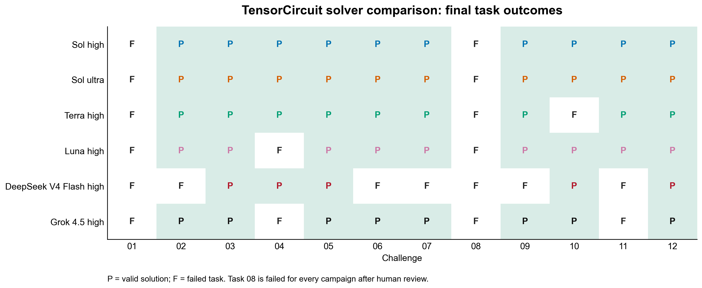
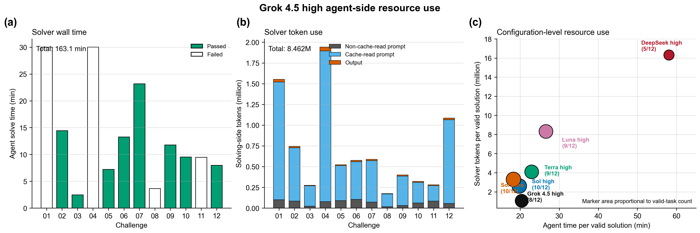

# Grok 4.5 High — TensorCircuit Benchmark

Grok 4.5 at `high` solver effort produced **8 valid solutions out of 12**. GPT-5.6 Sol at `high` independently audited every completed candidate.

## Protocol

- Solver: `grok-4.5`, `reasoning_effort=high`, through Codex CLI and the xAI API
- Auditor: `gpt-5.6-sol`, audit reasoning `high`
- Framework: TensorCircuit-NG in `challenge-benchmark-quantum-tensorcircuit:py311`
- Frozen base commit: `0201238ec2983907e2891f5319f5fff2d00844d5`
- Frozen task-copy SHA-256: `19fe27b83eaf668b3df32d1a68902b08cbe28585f189290769018eb16d927895`
- Resources: 6 CPU, 10,240 MiB memory, 16,384 MiB storage
- Tasks executed sequentially, with one selected non-infrastructure outcome per task
- Agent limit: 1,800 seconds; submitted solutions still proceed to verification

The local xAI compatibility layer only repairs integer declarations in tool JSON schemas and converts mathematically integral tool arguments to JSON integers where the active schema requires an integer. It does not alter prompts, semantic values, tool outputs, candidates, or task data.

## Results

| Task | Attempt | Outcome | Functional | Static | Audit | Runtime (s) |
|---:|:---:|:---:|---:|---:|---:|---:|
| 01 | r2 | Fail | 0 | 0 | 0 | — |
| 02 | r2 | Pass | 1 | 1 | 1 | 62.29 |
| 03 | r2 | Pass | 1 | 1 | 1 | 13.01 |
| 04 | r2 | Fail | 0 | 0 | 0 | — |
| 05 | r2 | Pass | 1 | 1 | 1 | 94.38 |
| 06 | r2 | Pass | 1 | 1 | 1 | 38.08 |
| 07 | r3 | Pass | 1 | 1 | 1 | 121.61 |
| 08 | r1 | Fail | 0 | 0 | 0 | — |
| 09 | r1 | Pass | 1 | 1 | 1 | 77.90 |
| 10 | r1 | Pass | 1 | 1 | 1 | 89.31 |
| 11 | r1 | Fail | 0 | 0 | 0 | — |
| 12 | r1 | Pass | 1 | 1 | 1 | 11.13 |

Eight tasks produced measured candidate runtimes totaling 507.71 seconds. Runtime is reported separately and does not reduce pass reward.

### Failed tasks

- **Task 01:** Grok reached the 1,800-second Agent limit before creating a candidate.
- **Task 04:** Grok reached the 1,800-second Agent limit before creating a candidate.
- **Task 08:** while recovering from hung profiling commands, Grok issued `pkill -f 'python'`. The broad full-command-line match terminated its own agent wrapper/proxy chain (exit 143).
- **Task 11:** Grok similarly issued `pkill -f "jax"` while trying to stop a long compilation, again terminating its own agent chain (exit 143).

Tasks 01 and 04 are retained as valid model timeout failures. Tasks 08 and 11 are retained as valid model tool-use failures. None was an infrastructure failure.

## Agent-side resources

The 12 selected outcomes used 163.1 minutes of Agent wall time and 8.462 million solving-side tokens: 0.805 million non-cache-read prompt tokens, 7.449 million cache-read prompt tokens, and 0.207 million output tokens. This is 20.39 Agent minutes and 1.058 million tokens per valid solution. All 12 selected outcomes use the same repaired compatibility protocol. The integration did not report xAI provider cost, so the comparison uses time and tokens rather than fabricating a dollar estimate.

## Provenance

Each `challenge-NN/` directory contains the selected solution when one exists, reward and audit outputs, functional output, complete solver log and session stream, xAI proxy log, Harbor configs/results, hashes, and a normalized `stamp-info.json`. Tasks 01, 04, 08, and 11 additionally contain `model-failure.json`.

Excluded attempts are documented in `summary.json`: Tasks 01–05 r1 are retained only as pre-repair provenance; Task 06 r1 had the integer-argument compatibility failure; Task 07 r1/r2 were interrupted during that diagnosis. The final resource accounting selects Tasks 01–05 r2 and the existing repaired-protocol outcomes for Tasks 06–12.
